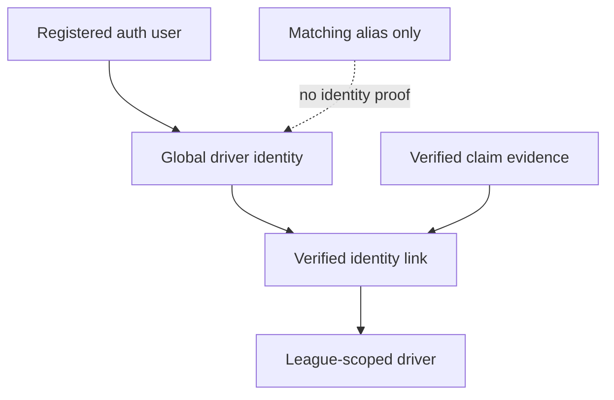

# Phase 4 — Global Driver Identity

Date: 2026-08-20

Status: implemented and verified in the isolated V2 staging project

## Implemented

- Added a global `driver_identities` record backed one-to-one by a registered `auth.users` account.
- Added the V1-compatible, league-scoped `drivers` table without copying any Production row.
- Added verified mappings from one global identity to multiple league-specific driver records through `driver_identity_links`.
- Added server-only `driver_claims` evidence with exactly three accepted verification paths: league invitation, unique claim link, or admin verification.
- Added `driver_aliases` for gamertags, display names, spelling variants, and legacy import matching.
- Enforced in the database that aliases are matching hints only and can never create an identity link.
- Enforced that every identity link references a matching, verified claim for the same registered user and legacy driver.
- Prevented one league-scoped driver record from being linked to multiple global identities.
- Enabled RLS and explicit least-privilege grants on every new table in the same migration.
- Added an authenticated, RLS-backed identity provider to the V2 React shell.
- Updated the four-language staging UI to show the current global identity state and linked-driver count.

## Files

- `v2/supabase/migrations/20260820152536_v2_global_driver_identity.sql`
- `v2/supabase/migrations/20260820152940_v2_immutable_linked_claim_evidence.sql`
- `v2/supabase/tests/phase-4-driver-identity.sql`
- `v2/scripts/assert-driver-identity.mjs`
- `v2/src/types/database.ts`
- `v2/src/driver/DriverIdentityProvider.tsx`
- `v2/src/App.tsx`
- `v2/src/components/AppShell.tsx`
- `v2/src/i18n/I18nProvider.tsx`
- `v2/src/styles.css`
- `v2/package.json`

## Data model

| Object | Purpose | Core invariant |
|---|---|---|
| `drivers` | V1-compatible league driver and historical result anchor | unique display name and optional gamertag inside one league |
| `driver_identities` | global active-driver identity | exactly one identity per registered user |
| `driver_claims` | server-side historical claim evidence | only invitation, unique-link, or admin verification is accepted |
| `driver_identity_links` | connects a global human to league records | matching verified claim required; one identity per legacy driver |
| `driver_aliases` | import/search matching hints | equality is never identity proof and never auto-links |

The migration is additive. No existing V1 result foreign key is rewritten, renamed, or dropped.

## Access model

| Object | `anon` | `authenticated` | `service_role` |
|---|---|---|---|
| `drivers` | requested public league only | requested public league only | full table access |
| `driver_identities` | none | own identity only | full table access |
| `driver_identity_links` | none | own links only | full table access |
| `driver_aliases` | none | own global aliases only | full table access |
| `driver_claims` | none | none | full table access |

No browser role has insert, update, or delete privileges on the Phase 4 tables. Claim issuance, verification, and link creation remain server-controlled.

## Claim safety

- Name, real name, display name, gamertag, alias, or spelling similarity is not an accepted verification method.
- A unique claim token is stored only as a 64-character SHA-256 hexadecimal digest; raw tokens are forbidden by the data contract.
- A pending or mismatched claim is rejected by the identity-link trigger.
- Once claim evidence backs a link, the complete evidence row is immutable.
- Deleting claim evidence removes its link; deleting a global identity never deletes historical league driver rows.
- Duplicate normalized aliases are prevented within one identity, while the same alias may intentionally exist for different people.

## Verification

| Gate | Result |
|---|---|
| Migration DDL plus full regression inside rollback transaction | passed |
| Applied staging migrations `20260820152536` and `20260820152940` | passed |
| Post-apply SQL regression against the live staging schema | passed |
| One registered user → one global identity | passed |
| Unverified claim → identity link | blocked |
| Mismatched claimant/driver claim → identity link | blocked |
| One legacy driver → multiple global identities | blocked |
| Alias equality → automatic link | blocked |
| Same alias for two different identities | allowed without merge |
| Anonymous League A → League B driver read | blocked |
| Authenticated identity A → identity B read | blocked |
| Browser read of claim evidence | blocked |
| Foreign-key index coverage | passed |
| Generated TypeScript schema integration | passed |
| TypeScript, 14 unit tests, isolation checks, contract checks, and production build | passed |

The SQL regression creates two synthetic auth users, two leagues, two drivers, claims, identities, aliases, and a verified link inside one transaction. It always rolls back. After verification, staging remains at zero rows for auth users and every Phase 3/4 public table.

## Advisor interpretation

The staging Security Advisor reports three explained notices:

1. `driver_claims` has RLS with no policy. This is intentional default-deny for a service-role-only evidence table.
2. `platform_owners` has RLS with no policy. This remains the intentional Phase 3 default-deny boundary.
3. Signed-in users may execute `is_platform_owner()`. This remains the documented actor-bound, zero-argument boolean RPC.

The Performance Advisor reports unused indexes. The database is empty, and the Phase 4 indexes cover foreign keys, alias matching, tenant reads, and expected identity lookups. None should be removed based only on the empty-staging signal.

Advisor references:

- <https://supabase.com/docs/guides/database/database-linter?lint=0008_rls_enabled_no_policy>
- <https://supabase.com/docs/guides/database/database-linter?lint=0029_authenticated_security_definer_function_executable>
- <https://supabase.com/docs/guides/database/database-linter?lint=0005_unused_index>

## Result

**PASS.** RaceVora V2 now has a global registered-driver identity layer that safely aggregates league-scoped history without treating mutable names as proof.

## Deferred by design

- No account, invitation, or claim-management UI is exposed yet.
- No browser-side claim mutation is allowed.
- No automatic legacy data migration or Production data copy has occurred.
- No Phase 5 role vocabulary or role-management write API is implemented here.
- Auth callback and redirect end-to-end testing still depends on the staging Auth dashboard allowlist.

## Next step

Phase 5 — Role Model: normalize driver, steward, league-admin, and platform-owner capabilities while preserving server-side actor and tenant checks.
