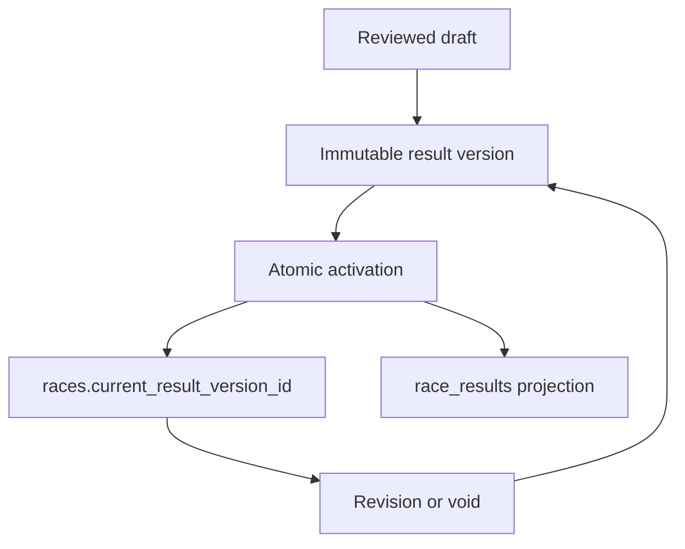

# Phase 6 — Result Versioning

Status: implemented and regression-tested in the isolated V2 Staging project (`znnkwjogtvzwfkwnmawp`). V1 Production (`kjccstcbqygxuqkvdaqw`) was inspected read-only and was not changed.

## Outcome

Phase 6 replaces destructive result replacement with an immutable official history and an explicit authoritative pointer. The existing `race_results` contract remains the fast current projection used by standings and other downstream readers.

Current state is never inferred from `MAX(version_number)`. A race-local counter allocates monotonically increasing numbers while holding a row lock; the separate `current_result_version_id` foreign key identifies the only authoritative official version.

## Read-only V1 contract evidence

The production catalog confirmed:

- `seasons → races → race_results` is the published/current path.
- `race_results` contains the established driver, position, timing, participation, penalty and points projection fields.
- `publish_race_result_draft(import_id, race_id, rows)` currently replaces the projection atomically after checking race/league ownership.
- Production currently contains one season, 36 races and 611 result rows. No row was copied to Staging.

The V2 implementation retains these projection fields and adds immutable provenance through `result_version_id`.

## Schema and lifecycle

### New history tables

- `result_versions` stores race-local version number, explicit predecessor, lifecycle state, change reason and audit timestamps/actors.
- `result_version_rows` stores the complete row snapshot for each version.
- `races.current_result_version_id` explicitly references the current active version.
- `races.next_result_version_number` allocates the next number under a race row lock without selecting a current version by number.
- `race_results.result_version_id` records exactly which version built every current projection row.

### Allowed lifecycle

| From | To | Meaning |
|---|---|---|
| `draft` | `validated` | Rows passed server-side publication validation |
| `validated` | `active` | Version became the explicit official result |
| `active` | `superseded` | A later validated revision became active |
| `active` | `void` | The official result was withdrawn with a reason |

Validated and official rows are immutable. Official versions cannot be hard-deleted. A revision creates a new version, preserves its predecessor, atomically rebuilds `race_results`, and then moves the explicit race pointer. A void preserves the withdrawn version while atomically clearing the pointer and projection.

## Security boundaries

- Anonymous and authenticated clients receive read-only access to the requested public league.
- Draft and validated versions are not publicly readable.
- Official history (`active`, `superseded`, `void`) is tenant-bound through the canonical league header.
- All lifecycle functions live in the non-exposed `private` schema and are executable only by the server role.
- Row validation rejects drivers and points owners from another league.
- A race pointer rejects versions from another race or versions that are not active.

The Supabase security advisor has no new Phase 6 findings. The existing intentional notices remain: service-only `driver_claims` and `platform_owners` have RLS without client policies, and the actor-bound boolean helper `is_platform_owner()` is an intentional callable `SECURITY DEFINER` function. All new foreign keys have covering indexes; remaining unused-index notices are expected on an empty Staging database.

## Regression evidence

`supabase/tests/phase-6-result-versioning.sql` runs inside `BEGIN … ROLLBACK` and proves:

1. First publication sets the explicit pointer and builds the projection.
2. Revision v2 supersedes v1 without changing v1 or its rows.
3. The projection contains only rows from the explicit current version.
4. Validated and official history cannot be mutated or hard-deleted.
5. Cross-league driver insertion and cross-race pointer manipulation fail closed.
6. Public reads cannot cross the requested tenant and cannot see drafts.
7. Void preserves history and clears both pointer and projection.
8. Browser roles have no result mutation privileges and cannot execute server-only lifecycle functions.

After the tests, all Staging domain tables contain zero rows.

## Migration inventory

- `20260820155505_v2_result_versioning.sql`
- `20260820155604_v2_result_versioning_indexes.sql`
- `20260820155929_v2_lock_result_version_audit.sql`
- `supabase/tests/phase-6-result-versioning.sql`
- `scripts/assert-result-versioning.mjs`

Phase 7 can now emit durable domain events from the activation and void boundaries without weakening this result-history contract.
