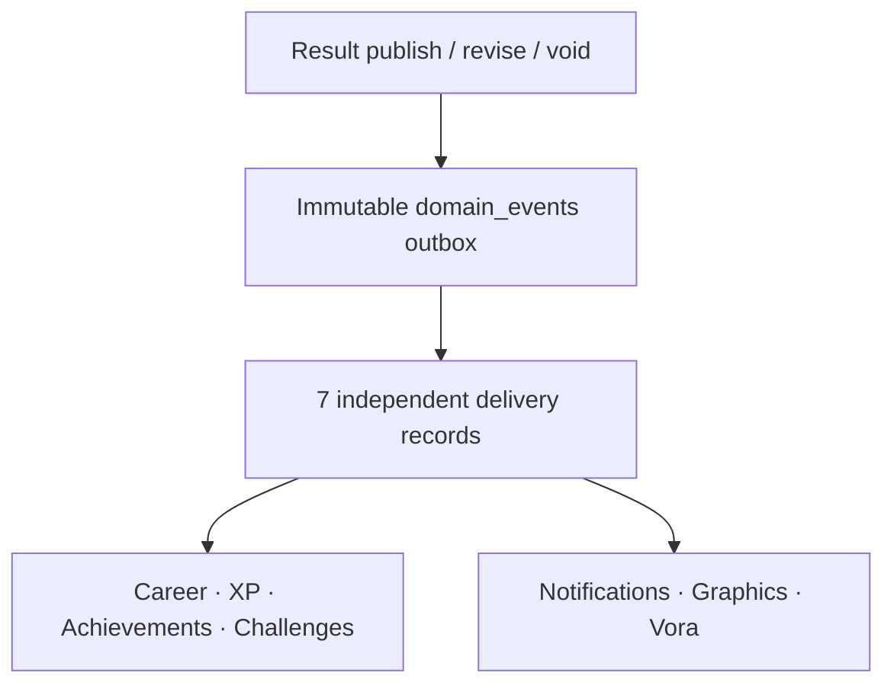

# Phase 7 — Domain Events / Processing

Status: implemented and regression-tested in the isolated V2 Staging project (`znnkwjogtvzwfkwnmawp`). V1 Production (`kjccstcbqygxuqkvdaqw`) was not changed.

## Outcome

Phase 7 introduces a transactional outbox and one independent delivery state per downstream processor. Result publication, revision, and void now record immutable facts without executing Career, XP, Achievements, Challenges, Notifications, Graphics, or Vora inside the sporting transaction.

Secondary-system failure cannot modify or roll back the authoritative result. The event is committed with the core workflow; processors claim and complete their own work afterward.

## Event contract

`public.domain_events` stores:

- event type, aggregate type/id and tenant id;
- optional result-version and actor references;
- immutable JSON payload and occurrence timestamp;
- globally unique idempotency key.

The Phase 6 lifecycle emits:

- first activation → `result.published`;
- activation with an explicit predecessor → `result.revised`;
- active version withdrawal → `result.voided`.

Retries with the same idempotency key return the original event and never duplicate its processing records. Reusing the key for different evidence fails closed.

## Processing contract

`private.domain_event_processing` creates exactly one record per event for each processor:

| Processor | Intended boundary |
|---|---|
| `career` | Driver career facts and statistics |
| `xp` | XP ledger and level consequences |
| `achievements` | Deterministic achievement evaluation |
| `challenges` | Deterministic challenge progress |
| `notifications` | User-facing delivery |
| `graphics` | Generated result graphics |
| `vora` | Vora narrative/output generation |

Each record has an independent status, attempt counter, next-attempt time, worker lease, last error, processed timestamp, and dead-letter cutoff after ten claims. Claims use `FOR UPDATE … SKIP LOCKED`; leases older than five minutes can be recovered. Completion and repeated identical failure recording are idempotent.

No processor implementation is shipped in this phase. Phase 7 establishes the durable contract that later deterministic engines and optional workers will consume.

## Partial-failure guarantees

- A Graphics failure leaves the official pointer and `race_results` projection unchanged.
- A Vora or notification failure cannot alter sporting data.
- One processor failure does not change any other processor state.
- Failed work becomes retryable without creating another event.
- After ten claims, a delivery becomes `dead_letter` for explicit operational handling.

## Security

- Browser roles cannot insert, update, or delete domain events.
- Processor state lives in the non-exposed `private` schema.
- Only the server role has table/function access to emission and processing operations.
- Authenticated Stewards and League Admins can read immutable events only for their requested league; Platform Owner retains the separate global audit path.
- Drivers and anonymous users cannot read the event outbox.
- Recorded events cannot be updated or deleted, including by ordinary server workflows.

The Security Advisor has no new Phase 7 notice. Existing intentional notices remain for service-only `driver_claims` and `platform_owners`, plus the documented actor-bound `is_platform_owner()` boolean RPC. Unused-index notices are expected while Staging is empty.

## Regression evidence

`supabase/tests/phase-7-domain-events.sql` runs inside `BEGIN … ROLLBACK` and proves:

1. Publish creates one immutable event and exactly seven processor records.
2. Repeated emission is idempotent; conflicting evidence is rejected.
3. Graphics failure preserves the official result and all other processor states.
4. Failed processing can be claimed again with an incremented attempt number.
5. Repeated completion is idempotent.
6. Revision and void emit their own event types.
7. Event evidence cannot be mutated.
8. Audit reads cannot cross tenant or actor-membership boundaries.
9. Browser roles cannot call server-only event functions.

After the regression, events, processor rows, result versions and projections all contain zero rows.

## Migration inventory

- `20260820161321_v2_domain_events_processing.sql`
- `20260820161418_v2_event_processing_service_policy.sql`
- `supabase/tests/phase-7-domain-events.sql`
- `scripts/assert-domain-events.mjs`

Phase 8 can now implement the Career processor against stable source events without coupling career calculations to result publication.
