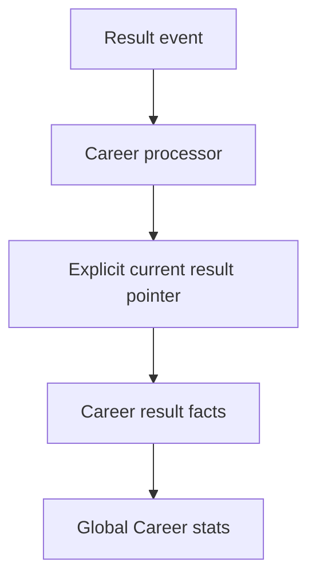

# Phase 8 — Career Engine

## Outcome

Phase 8 introduces a deterministic global Career projection without changing or backfilling V1 Production. One registered global driver identity can now accumulate an official Career across multiple verified league-scoped driver records.

## Source of truth

- `result_versions` and `result_version_rows` remain the immutable official history.
- `races.current_result_version_id` remains the only authoritative current state; Career never infers it from the highest version number.
- `career_result_facts` is a rebuildable per-race projection for active registered identities.
- `driver_career_stats` is a rebuildable cross-league aggregate derived only from those facts.
- `classification_status` adds the canonical `classified`, `dns`, `dnf`, and `dsq` sporting outcomes to both immutable rows and the current result projection.

## Identity and progression boundary

Career joins `driver_identity_links` to the league-scoped `drivers` rows contained in official results. The global identity and linked driver must both be active, the result row must be a human `PLAYER`, and the link must already be backed by verified claim evidence. Historical unclaimed drivers remain visible in official result history but receive no active V2 Career progression. Names and aliases never create a Career link.

## Deterministic corrections

`private.process_career_event` owns one leased `career` delivery. For publish, revision, and void events it resolves the race from immutable event evidence, locks the race, then rebuilds that race from its explicit current result pointer. Existing facts for that race are replaced, and only affected identities are re-aggregated.

This makes delivery idempotent and convergent:

- repeated delivery cannot add a second race fact;
- a delayed publication event still converges to a newer current revision;
- a revision replaces the previous contribution;
- a void removes the contribution while preserving result history and the domain-event audit;
- DNS does not count as a start, while DNF and DSQ do;
- BOT rows and unclaimed historical drivers do not enter progression.

## Access contract

- Anonymous clients cannot read Career data.
- An authenticated driver can read their own global facts and aggregate across leagues.
- Stewards and league administrators can read race facts only inside the canonically requested league.
- League roles cannot read another driver's global aggregate.
- Platform owners retain global read visibility.
- Browser roles cannot mutate projections or execute the Career processor.

## Verification

`supabase/tests/phase-8-career-engine.sql` proves cross-league aggregation, DNS/DNF/DSQ metrics, BOT and unclaimed-driver exclusion, revision and void correction, stale-event convergence, idempotency, tenant-bound staff access, private global totals, and transactionally rolled-back fixtures. `scripts/assert-career-engine.mjs` statically protects the same contracts in CI.
