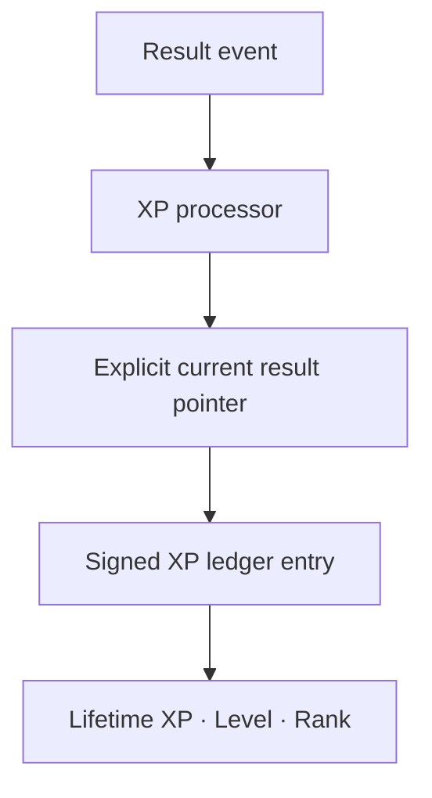

# Phase 9 — XP / Level / Rank

## Outcome

Phase 9 adds global, event-derived progression without changing V1 Production. XP belongs to the registered global driver identity, not to a league-scoped driver row. The append-only `xp_ledger` is the source of truth; `driver_progression` is a rebuildable projection for Lifetime XP, Level, and Rank.



## XP rule v1

The initial rule is deliberately transparent and deterministic. It does not depend on AI, championship points, paid content, or a seasonal progression track.

| Official classification | XP |
|---|---:|
| DNS | 0 |
| DSQ | 0 |
| DNF | 40 base |
| Classified | 100 base |

Classified drivers additionally receive `5 × max(0, 21 − finish position)`, 50 XP for a win, 25 XP for a podium, 15 XP for pole, and 15 XP for fastest lap. DNF can retain a verified pole or fastest-lap bonus. A classified win from pole with fastest lap is therefore 305 XP.

The ledger records the rule version and metadata containing the previous and desired race contribution. Future rule changes require a new version; old entries remain explainable.

## Append-only corrections

Every non-zero entry contains:

- global driver identity;
- immutable source domain event and processor delivery;
- reason code and signed amount;
- league, race, and authoritative result-version scope;
- globally unique idempotency key;
- occurrence and recording timestamps.

`private.process_xp_event` locks its XP delivery, resolves the race from immutable event evidence, then reads `races.current_result_version_id`. It calculates the desired current XP contribution independently of Career processing and compares it with the ledger's existing net contribution for that race.

- First publication appends a positive `result_award`.
- Revision appends only the signed delta as `result_adjustment`.
- Void appends the exact negative reversal.
- Repeated or delayed deliveries converge without double counting.
- Existing entries are never updated or deleted.
- BOT rows, inactive identities/drivers, and unclaimed historical drivers receive no active V2 XP.

## Levels and Ranks

Level is derived from Lifetime XP:

```text
level = min(100, floor(lifetime_xp / 1000) + 1)
```

There is no independent mutable Level balance. `driver_progression` stores only a rebuildable read projection, including progress to the next level.

| Level | Rank |
|---:|---|
| 1–4 | Rookie |
| 5–9 | Challenger |
| 10–19 | Racer |
| 20–29 | Contender |
| 30–39 | Front Runner |
| 40–49 | Elite |
| 50–64 | Apex |
| 65–79 | Master |
| 80–94 | Legend |
| 95–99 | Icon |
| 100 | Immortal |

Level 100 starts at 99,000 Lifetime XP and is capped. Its canonical rank is exactly **Immortal**.

## Historical progression

The ledger reserves `historical_backfill` as an audited entry type so reviewed historical results can later generate XP, Level, and Rank. No Production rows are copied automatically, and historical races never create retroactive Vora Credits.

## Access contract

- Anonymous clients cannot read XP or progression.
- Authenticated drivers can read their own global ledger and projection across leagues.
- Stewards and league administrators can read result-derived ledger entries only inside the canonically requested league.
- League roles cannot read another driver's global Level/Rank projection.
- Platform owners retain the separate global audit path.
- Browser roles cannot write ledger/projection rows or execute processor functions.
- The server role has append-only ledger privileges; even privileged updates and deletes are blocked by an immutability trigger.

## Verification

`supabase/tests/phase-9-xp-level-rank.sql` runs inside `BEGIN … ROLLBACK` and proves XP rule v1, cross-league totals, DNS/DNF/DSQ behavior, BOT and unclaimed exclusion, worker ownership, repeated delivery, negative revision adjustments, void reversal, stale-event convergence, immutable history, idempotency, every Rank boundary including Immortal, and tenant-bound RLS.

`scripts/assert-xp-level-rank.mjs` protects the same architecture in CI. After the live regression, XP, progression, result, Career, event, and processing tables remain empty.
