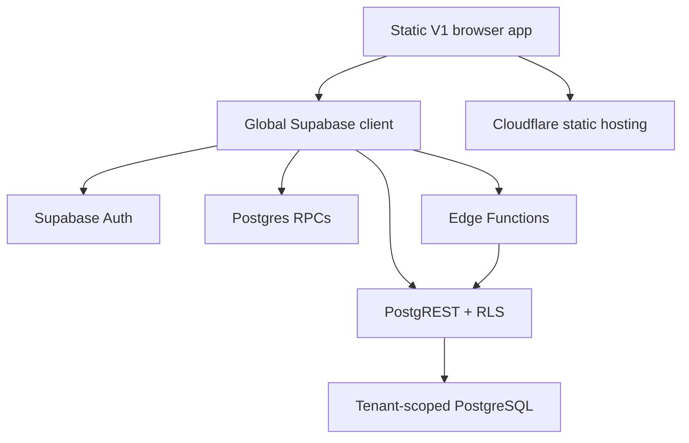
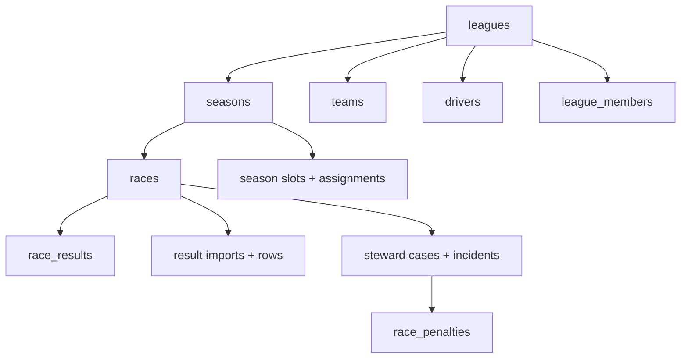
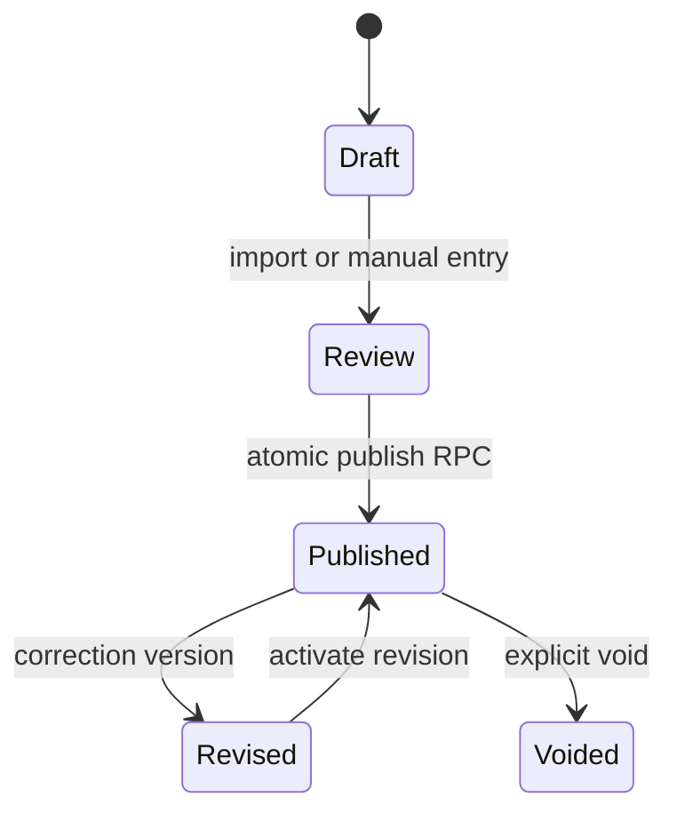

# V1 Contract Report

Date: 2026-08-20

Scope: Production V1 repository and read-only metadata inventory of Supabase project `kjccstcbqygxuqkvdaqw`

Protected tenant: `rcc`

This report closes the Phase 0 inventory gap retrospectively. No Production data, schema, configuration, functions, storage objects, or deployment settings were changed while collecting it. The SQL files under `database/` are a partial historical change log, so live read-only catalog metadata is the authoritative source for the current contract.

## 1. Architecture Map

### Repository and frontend

- V1 is a multi-page static application: root HTML documents load shared JavaScript and CSS from `assets/`.
- `assets/js/supabase-client.js` creates the canonical browser client, derives the active league, attaches the tenant header, owns the session-aware league context, and gates navigation affordances.
- `assets/js/services/rcc-data.js` is the main read service and includes tenant-scoped cache keys and request deduplication.
- Page controllers live under `assets/js/pages/`; reusable workflows live under `assets/js/components/`; domain read services live under `assets/js/services/`.
- The browser uses a publishable/legacy anon credential. Authorization is expected to remain in RLS, grants, RPC checks, and Edge Functions—not in UI visibility.

### Production-relevant route groups

| Group | Routes | Contract |
|---|---|---|
| Public platform | `index.html`, `regeln-faq.html`, legal pages | Public discovery, login entry, legal and withdrawal flows |
| Championship | `kalender.html`, `ergebnisse.html`, `fahrer-wm.html`, `team-wm.html`, `grid.html` | Published league data and standings |
| Hubs and profiles | `race-hub.html`, `rennen-detail.html`, `fahrer-profil.html`, `team-profil.html`, `strecken.html`, `strecken-profil.html` | Tenant-aware navigation and record views |
| History and comparison | `saison-archiv.html`, `hall-of-fame.html`, `rekorde.html`, `head-to-head.html` | Historical results and derived records |
| Stewarding | `stewards.html` | Public closed cases plus authenticated staff workflow |
| Identity | `register.html`, `account-setup.html`, `forgot-password.html`, `set-password.html` | Sign-up, onboarding, recovery, and password setup |
| Administration | `admin.html` | League administration, results, roster, branding, and owner switching |

### Deployment topology

- V1 Production remains on the existing Cloudflare project/domains and `main` branch.
- V2 is isolated under `v2/`, deploys from `v2-development`, and has a separate Cloudflare Worker and separate Supabase project.
- Root `_headers` and workflow checks enforce CSP and operational guards for V1. V2 has its own `v2/public/_headers` and `v2/wrangler.jsonc`.

## 2. Database Dependency Map

The live `public` schema contains 29 tables and four views. All 29 tables have RLS enabled. The catalog contains 58 foreign-key edges; the diagram shows the critical dependency spine rather than every edge.

### Object groups

| Domain | Tables/views | Key dependencies |
|---|---|---|
| Tenancy and access | `leagues`, `league_members`, `platform_owners`, `league_registration_keys`, `app_admins`, `admin_profiles` | Membership and owner identity ultimately reference `auth.users`; league slug selects request context |
| Championship | `seasons`, `races`, `teams`, `drivers`, `championship_history`, `league_content` | League → season → race; league → teams/drivers/content |
| Roster and slots | `driver_season_assignments`, `season_team_slots`, `season_driver_slots`, `driver_slot_assignments`, `race_substitutions` | Season-, race-, team-, and driver-bound temporal assignments |
| Results | `race_results`, `race_result_imports`, `race_result_import_rows`, `race_penalties` | Race and driver are central; imports preserve draft/publish/version state |
| Stewarding | `steward_cases`, `steward_incidents`, `driver_track_notes` | Race, league, actor, accused driver, and consequence dependencies |
| Consumer/compliance | `consumer_withdrawals`, `contract_confirmations` | Server-only records; no browser grants |
| AI and external content | `ai_profiles`, `ai_analysis_usage`, `f1_news_cache` | AI quota is server-only; profiles may be publicly readable; news cache is server-only |
| Derived views | `v_driver_context`, `v_driver_standings`, `v_season_points_ledger`, `v_team_standings` | All four use `security_invoker=true`, preserving underlying RLS |

### Production cardinality snapshot

The read-only snapshot found two leagues, one season, 36 races, 40 drivers, 10 teams, 611 result rows, 456 import rows, four steward cases, two memberships, and one platform owner. These values are operational evidence, not seed data. They must not be copied into staging automatically.

### Trigger contracts

- Cross-tenant validation triggers protect driver assignments, season slots, slot assignments, and steward incidents.
- Result triggers synchronize fractional/legacy points, attribute results to slots, and apply DSQ consequences after publish.
- Membership triggers protect the platform-owner role and maintain timestamps.
- League triggers maintain timestamps and registration-key projections.
- Withdrawal insert rate limiting is enforced by a database trigger.

## 3. Auth & Role Map

### Auth flow

| Flow | Browser implementation | Server boundary |
|---|---|---|
| Password sign-in | landing/admin controllers call `signInWithPassword` | Supabase Auth; Turnstile wrapper adds a captcha token |
| Registration | `register.html` and `account-setup.html` | Auth sign-up plus `finalize-consumer-registration` and league-creation RPC |
| Recovery | `forgot-password.html` calls `resetPasswordForEmail`; `set-password.html` updates the password | Redirect allowlist and recovery session are authoritative |
| Invitation/member management | Admin member UI invokes `manage-league-member` | Edge Function authenticates actor and uses privileged server access only after checks |
| Session state | `getSession` and `onAuthStateChange` drive UI state | JWT plus RLS/RPC/Edge Function checks authorize data actions |

User-editable metadata is used only to carry pending onboarding values in V1. It is not an acceptable authorization source for V2.

### Tenant resolution

1. Resolve `league` from the query string, then `/l/{slug}`, then session storage, finally `rcc`.
2. Normalize the slug.
3. Send `x-rcc-league-slug` on every Supabase request.
4. Database helper `requested_league_slug()` reads this header and currently falls back to `rcc`.
5. `matches_requested_league()` combines the header with league lookup and excludes owner-only leagues.

The fallback is a compatibility contract but also a risk: any client using a wrong or missing header can silently target `rcc`. V2 must send the exact canonical header and should progressively move toward explicit, fail-closed request context.

### Role translation

| V1 source | V2 visible role | Notes |
|---|---|---|
| `member` | `driver` | Registered normal user |
| `steward` | `steward` | Driver capabilities plus steward workflow |
| `admin` | `league_admin` | Full administration for own league |
| legacy league `owner` | `league_admin` | Must not become the global owner role |
| row in `platform_owners` | `platform_owner` | Separate global authority; no membership required |

V1 member listing hides the legacy `owner` row in the browser for non-platform owners. That is not sufficient for V2: owner invisibility must be enforced by the server response and normal league member APIs must not manage platform owners.

## 4. Result Workflow Map

- Manual entry and AI image import both create reviewable result material.
- `race_result_imports` and `race_result_import_rows` hold import, review, publication, and correction context.
- `publish_race_result_draft` is the atomic publication boundary used by V1.
- `race_results` is the published/current projection used by standings and downstream views.
- Published corrections are versioned; current state must not be inferred with an unqualified `MAX(version)`.
- Steward consequences and race penalties can affect published results; DSQ application is trigger-backed.
- Publish receipts, review hardening, correction UI, version history, and result guards are separate V1 components and matching CI smoke tests.
- Social graphics, records, standings, XP, and future gamification are downstream of the authoritative current result state.

## 5. Security Boundary Map

| Boundary | Current contract | V2 requirement |
|---|---|---|
| Browser key | Publishable/anon only; no service role | Preserve and scan bundles for privileged keys |
| Tenant | Header plus league-aware RLS/RPC checks | Exact `x-rcc-league-slug`; reject malformed context; test cross-tenant IDs |
| Row access | RLS enabled on every public table | Default deny and add policies/grants with every additive table |
| Views | Four public views, all `security_invoker=true` | Keep invoker or remove browser grants |
| Privileged functions | 25 relevant `SECURITY DEFINER` functions | Classify, revoke default `PUBLIC EXECUTE`, bind actor and tenant, harden `search_path` |
| Server-only tables | Five RLS tables have no policies and only `service_role` access | Preserve default-deny intent and document access paths |
| Edge Functions | Five functions; privileged clients are created server-side | Verify JWT, actor, tenant, payload, CORS, rate limit, and audit before privileged writes |
| Storage | Public `league-brand-assets`, 2 MiB, image MIME allowlist | Retain path-scoped write policies and treat SVG as active content |

### Advisor snapshot

- Security: 27 notices—five informational no-policy tables, 21 authenticated `SECURITY DEFINER` execution warnings, and leaked-password protection disabled.
- The five no-policy tables are `ai_analysis_usage`, `consumer_withdrawals`, `contract_confirmations`, `f1_news_cache`, and `platform_owners`; catalog grants show service-role-only access.
- Leaked-password protection requires a paid Supabase plan and cannot be enabled on the current Free plan.
- Performance: 26 unused-index notices. No index may be removed solely because the advisor says “unused”; production traffic, FK coverage, and future V2 queries must be considered.

## 6. Production Critical Components

1. The `rcc` league row and its complete historical dependency graph.
2. The canonical tenant header and `requested_league_slug()` fallback behavior.
3. RLS policies that distinguish public published reads, authenticated tenant reads, league staff writes, and platform-owner access.
4. Atomic result publish/correction functions and result-version history.
5. Slot attribution and substitution history used to assign driver and team points correctly.
6. Steward cases, penalties, DSQ triggers, and published-result guards.
7. `platform_owners` as the only global owner source.
8. Auth recovery/invitation redirects and Turnstile-protected auth operations.
9. The `league-brand-assets` storage bucket and path-based tenant access.
10. Cloudflare headers, Production health workflows, tenant security guards, and encrypted off-site backup automation.

### Backup and recovery

- `.github/workflows/encrypted-offsite-backup.yml` orchestrates encrypted off-site backup.
- `scripts/backup-supabase.sh` and `scripts/backup-public-storage.py` cover database and public storage export paths.
- `docs/offsite-backup-activation.md` and `docs/operations-runbook.md` define activation and response procedures.
- V2 cutover requires a migration rehearsal and rollback checkpoint; backup existence alone is not proof of restoreability.

## 7. Reusable V2 Components

| Reuse | Decision |
|---|---|
| Tenant header name and slug rules | Reuse as an explicit compatibility contract; remove silent client-side ambiguity |
| Database tables and foreign keys | Evolve additively; do not rename or drop V1 objects during migration |
| Security-invoker standings/context views | Reuse after tenant regression tests |
| Atomic publish and correction concepts | Preserve business invariants; wrap or version APIs rather than bypassing them |
| Slot/substitution attribution | Preserve because historical points depend on it |
| Edge Function actor/tenant patterns | Reuse selectively after a function-by-function audit |
| Track metadata and formula tests | Reuse as static domain data and regression inputs |
| Cloudflare CSP/no-index/cache controls | Reuse in the isolated V2 Worker configuration |
| Backup runbooks and health checks | Extend for V2 staging and later cutover |
| V1 UI components | Use as behavioral references, not direct React components |

## 8. Migration Risk Register

| Risk | Severity | Evidence | Mitigation/gate |
|---|---:|---|---|
| V2 sends a noncanonical tenant header and falls back to `rcc` | Critical | V2 used `x-racevora-league`; DB/V1 use `x-rcc-league-slug` | Fix and unit-test before any V2 data access |
| Partial local migration history cannot recreate live Production | Critical | Repository SQL is explicitly incomplete | Build a reviewed live-schema baseline; rehearse only in staging |
| Cross-tenant ID manipulation | Critical | Multi-tenant tables and privileged RPCs accept object IDs | RLS/RPC matrix for actor A/B, tenant A/B, and manipulated IDs |
| Platform owner leaks into normal member management | High | V1 filters a returned owner row in UI | New server-enforced V2 member API that excludes global owners |
| Actor parameters allow membership/role probing | High | Helper RPCs accept optional/arbitrary user IDs | Create actor-bound public wrappers; move internal helpers private |
| Privileged functions have broad execute grants | High | 21 advisor warnings | Explicit A/B/C/D classification, revoke PUBLIC, least-privilege grants |
| Missing request-tenant checks in legacy mutators | High | Several functions authorize membership by league ID only | Add request-context match in staging-compatible V2 variants |
| Result correction changes derived standings/history | High | Results feed several views and workflows | Golden-data migration rehearsal and publish/revise/void tests |
| Public SVG brand asset executes active content in some contexts | Medium | Public bucket permits `image/svg+xml` | Sanitize or disallow SVG before V2 user uploads |
| Auth redirects point to the wrong origin | Medium | Separate V2 Worker origin | Exact staging Site URL and redirect allowlist before auth E2E |
| Advisor “unused” indexes removed prematurely | Medium | 26 notices | Observe/rehearse queries; never delete from advisor signal alone |
| Hardcoded strings and legacy roles escape into V2 | Medium | V1 UI is mostly German and role literals differ | Central i18n and fail-closed role mapping with CI checks |

## 9. Technical Debt Affecting V2

- Static multi-page V1 code depends heavily on global `window` state and shared script ordering.
- Production Supabase URL and browser key are embedded directly in V1 client code; acceptable for a public key, but environment separation is weak.
- Tenant fallback to `rcc` hides missing-header defects instead of failing closed.
- The repository cannot bootstrap the live schema from local migrations alone.
- Privileged functions mix external APIs, RLS helpers, triggers, and legacy utilities in `public`.
- Some actor helper functions allow a caller-supplied user ID; V2 should bind the actor to `auth.uid()` at the external boundary.
- Server-side member listing and client-side owner filtering do not satisfy the V2 owner-separation requirement.
- Browser grants on many RLS tables are broader at the table-privilege layer than the actual UI needs; RLS carries most of the security burden.
- V1 auth and error strings are not consistently centralized for four-language delivery.
- Result workflow logic is distributed across several browser components, RPCs, triggers, and views; there is no single complete local contract test.
- Backup automation exists, but restore rehearsal evidence must be a cutover gate.

## 10. Recommendation for Phase 1

Proceed with an isolated V2 staging foundation only, using:

1. a dedicated `v2-development` branch and `v2/` application root;
2. a separate Supabase project with a distinct publishable key;
3. a separate Cloudflare Worker and staging URL;
4. a hard runtime deny-list for the Production project reference;
5. the exact canonical tenant header plus regression tests;
6. no Production writes or data cloning;
7. no schema implementation until the Security Foundation classifies RPCs and a complete additive baseline is reviewed.

Phase 1 is acceptable only when local verification, Cloudflare dry-run, live staging smoke checks, and Production isolation scans pass. Auth E2E remains blocked until the staging Site URL and redirect allowlist are configured explicitly.
